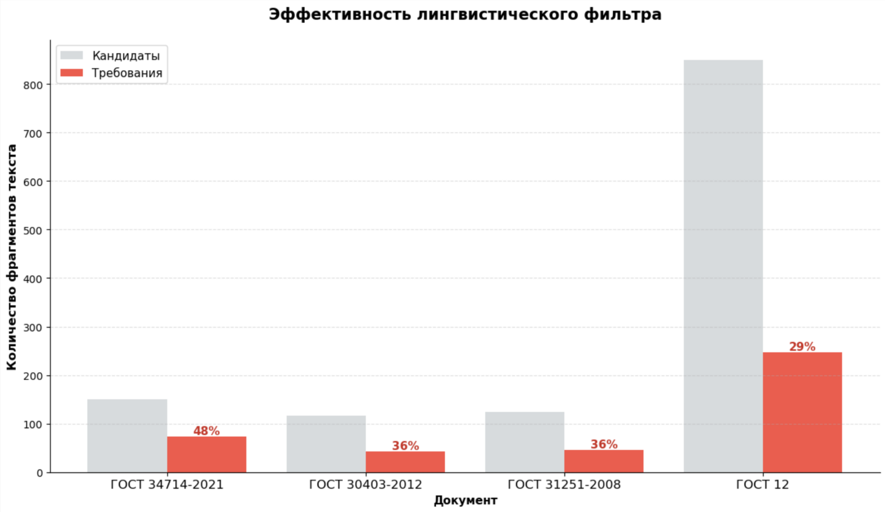
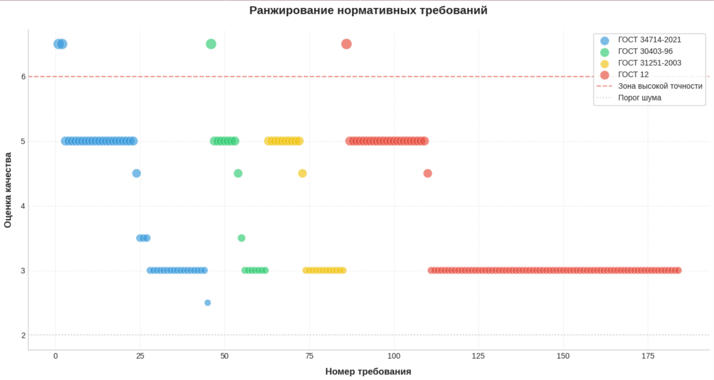

# Экстрактор нормативов
Архитектура на основе методов анализа текста, которая извлекает из документов нормативы и указания на требования с сайта [meganorm.ru](http://meganorm.ru) Проект включает:
- **python** язык, на котором написана архитектура;
- **backend** на FastAPI для обработки документов;
- **frontend UI** на streamlit для удобного взаимодействия;
- **ядро системы** с лингвистическим анализом, скорингом требований и классификацией требований на основе алгоритма машинного обучения;
- **аналитику** требований с помощью matplotlib;
- **docker** для простого развертывания.
# Основные результаты исследования
Создавая архитектуру (подробности в [description.ipynb и description_ML.ipynb](https://github.com/VitaliiNovikov75/stability/normative_extractor/blob/main/research/)) я принял решение использовать максимально легкие и быстрые библиотеки, чтобы обеспечить минимальную задержку, предварительную фильтрацию кандидиатов по паттернам RegEx и предсказание требований с помощью MultinomialNB.

Итог очевиден и краток: RegEx - быстрый фильтр, а модель интеллектуальная надстройка для сложного контекста.
## Анализ эффективности линвистического фильтра
Для оценки работы алгоритма был проведен анализ четырех нормативных документов. График ниже иллюстрирует соотношение общего количества найденных кандидатов (серый цвет) к реально подтвержденным требованиям (красный цвет).

**Основные выводы:**
- Алгоритм эффективно сокращает объем данных для анализа, отсеивая от **52% до 71%** нерелевантных фрагментов текста.
- Фильтр одинаково эффективно работает как с небольшими документами до 150 фрагментов, так и с объемными стандартами.
- Использование лингвистического фильтра позволяет сфокусировать внимание  модели только на **29–48%** текста, который действительно содержит нормативные предписания.
<p align="center">
  
</p>
## Ранжирование на основе scoring
График отражает распределение качества найденных фрагментов для четырех различных ГОСТов. Каждая точка — это кандидат, оцененное алгоритмом по шкале от 2 до 7.

**Ключевые показатели:**
- **Зона высокой точности, выше 6.0**: Алгоритм выделил наиболее четкие и однозначные требования в каждом документе (красная пунктирная линия).
- **Стабильное ядро, оценки 3–5**: Основная масса требований сосредоточена в этом диапазоне. Это качественные данные, которые составляют костяк нормативной базы документа.
- **Порог шума, ниже 2.0**: Установленный лимит позволяет эффективно отсекать нерелевантный текст (заголовки, вводные фразы, примечания), который не несет нормативной нагрузки.
<p align="center">
  
</p>
Архитектура успешно ранжирует кандидатов, позволяя проверять наиболее важные и автоматически отсеивать информационный шум.
## Пример извлеченных требований
В папке data/processed лежит файл CSV с извлеченными требованиями.

| № | Документ | Кандидат | Требование |
| :----------------------: | :----------------------: | :---------------------- | :---------------------- |
| 82 | ГОСТ 34714-2021 | 7.6.3 Утечка в затворах не должна превышать значений, установленных для соответствующих классов герметичности по ГОСТ 9544. | 1 |
| 114 | ГОСТ 30403-96 | Испытание образцов проводят при температуре окружающего воздуха от 10 °C до 40 °C, скорости его движения не более 0,5 м/с и относительной влажности (60 +/- 15)%, измеренных на расстоянии от 1 до 1,5 м от поверхности образца. | 1 |
| 118 | ГОСТ 30403-96 | Способность к воспламенению газов, выделяющихся при термическом разложении материалов образца, проверяют посредством поднесения горящего факела к местам выхода этих газов на необогреваемые поверхности образца не реже чем через каждые 5 мин испытания и через каждую минуту - при появлении вспышек газа; длина намотки факела должна быть не менее 150 мм, а диаметр - не менее 40 мм. | 1 |
| 124 | ГОСТ 30403-96 | Повреждением считается обугливание, оплавление и выгорание материалов, из которых изготовлена конструкция, на глубину более 2 мм. | 1 |
| 127 | ГОСТ 30403-96 | Номенклатура показателей и методы их определения ГОСТ 6616-94. | 0 |
# Структура проекта
```
├── data/                     # локальное хранилище
│   ├── raw/                  # сырые загруженные файлы
│   └── processed/            # извлеченные структурированные знания
├── models/
│   ├── __init__.py
│   └── model.py              # настройки векторайзера и веса модели
├── src/                      # исходный код
│   ├── __init__.py
│   ├── api/                  # backend слой
│   │   ├── __init__.py
│   │   └── main.py           # точка входа API
│   ├── core/                 # ядро системы
│   │   ├── __init__.py
│   │   ├── engine.py         # оценка релевантности предложений 
│   │   ├── processor.py      # очистка и сегментация текста
│   │   ├── orchestrator.py   # связывает компоненты в единый цикл
│   │   ├── predict.py        # предобработка и классификация текста
│   │   └── models.py         # pydantic модели
│   └── utils/                # вспомогательный код
│       ├── loader.py         # работа с http/selectolax
│       └── visual.py         # визуализация результатов
├── tests/                    # юнит-тесты
│   ├── conftest.py           # фикстуры
│   ├── test_engine.py        # тест ScoringEngine
│   ├── test_orchestrator.py  # тест NormativeOrchestrator
│   ├── test_processor.py     # тест TextProcessor
│   └── test_loader.py        # тест MeganormLoader
├── research/                 # исследовательская часть
│       ├── description.ipynb
│       └── description_ML.ipynb  
├── docs/                     # документация sphinx
├── .gitignore
├── Dockerfile                # инструкция сборки образа
├── .dockerignore
├── docker-compose.yml        # оркестрация API + UI + docs
├── requirements.txt          # зависимости python
├── app.py                    # streamlit приложение
├── LICENSE
└── README.md
```
# Запуск
## В Windows через docker
```powershell
git clone https://github.com/VitaliiNovikov75/normative_extractor.git
cd C:\Users\пользователь\Desktop\normative_extractor

docker compose -p normative_extractor up -d

docker exec normative_extractor-api-1 sphinx-build -b html docs/source docs/build/html
```
## Linux
### Через окружение python
```bash
git clone https://github.com/VitaliiNovikov75/normative_extractor.git
cd normative_extractor

python -m venv .venv
source .venv/bin/activate

pip install -r requirements.txt

streamlit run app.py &

cd docs
make html
cd build/html
python -m http.server 8080
```
### Через docker
```bash
git clone https://github.com/VitaliiNovikov75/normative_extractor.git
cd normative_extractor

sudo systemctl start docker
docker compose -p normative_extractor up -d --build

docker exec normative_extractor-api-1 sphinx-build -b html docs/source docs/build/html
```
## Доступ к сервисам
- Streamlit UI: [localhost:8501](http://localhost:8501);
- API: [localhost:8000](http://localhost:8000/);
- swagger API Docs: [localhost:8000/docs](http://localhost:8000/docs);
- sphinx тех. документация: [localhost:8080](http://localhost:8080).
# Использование
1. Откройте [localhost:8501](http://localhost:8501);
2. введите URL документа;
3. нажмите "Извлечь";
4. сохраните результаты через "Скачать в CSV" либо "Очистить все данные".
# Функциональность
## Вкладка "Извлечение"
- Ввод URL документа;
- извлечение кандидатов с отображением примеров;
- скачивание результатов в CSV
- очистка всех данных
## Вкладка "Аналитика"
- Метрики загрузки — размер документов в КБ и количество символов;
- доля предложений — распределение по документам;
- эффективность фильтра — сравнение кандидатов;
- ранжирование кандидатов — scatter plot с оценкой качества;
- статистика — общее количество, средний и максимальный score;
- пузырьковая диаграмма — топ самых частых слов в требованиях.
# Стек
- FastAPI — веб-фреймворк;
- uvicorn — асинхронный веб-сервер;
- re — паттерны извлечения кандидатов;
- streamlit — интерактивный UI для данных;
- pydantic — валидация данных;
- pandas — обработка табличных данных;
- matplotlib, seaborn — визуализация;
- selectolax — быстрый HTML парсер;
- docker — контейнеризация;
- numpy — библиотека для научных вычислений;
- httpx — для запросов;
- fake_useragent — генерация строк User-Agent;
- sphinx — документация;
- natasha — извлечение признаков и эмбеддингов.

